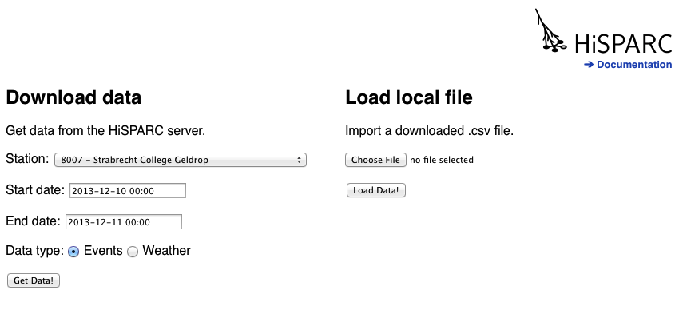
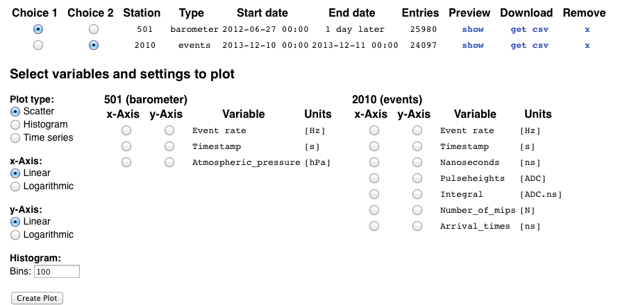
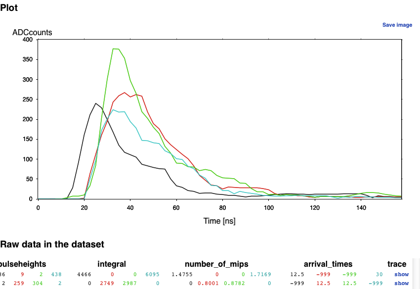

.. include:: subst.inc

Data retrieval
==============

This page describes the functions of the `Data retrieval
<http://data.hisparc.nl/media/jsparc/data_retrieval.html>`_ web
application. With this web application you can retrieve |hisparc| data,
with which you can make plots.

Here is a step by step guide for the functions of the page.

Get data
--------

The page will be quite empty at first and only show the |hisparc| logo
and two forms with which you can either download data or load local
datafiles. Whenever the |hisparc| logo becomes animated, it indicates
that data is being retrieved from the |hisparc| servers.

.. _get_data:

   The two forms to load data and the |hisparc| logo indicating activity.

Download data
^^^^^^^^^^^^^

If you choose to download data you can first select a |hisparc| station,
the start and end date (and time) and the type of data you want to get.
Once you have made your choices click *Get Data!*.

Local data
^^^^^^^^^^

If you already have a .tsv file (tab-separated values) on your computer,
you can load that into the web application. The application will try to
interpert the filename of the .tsv the following way: *[data
type]-s[station number]-[start date]_[end date]*. If the data type is
one of the types provided by the |hisparc| Public Database the web
application tries to identify the columns, otherwise it will simply
give each column a number.

Data overview
-------------

Once the data has been (down)loaded a new section on the website
appears, giving you and overview of all the datasets that you have. It
is possible to get multiple datasets, simply use the form again to get
another.

For each downloaded dataset you can see the options that were used in
the form, the number of entries it contains. Each row also has controls
to choose, preview, download and remove a dataset.

.. _data_overview:
.. figure:: images/data_overview.png
   :align: center
   :width: 425

   An overview of the loaded datasets.

Controls
^^^^^^^^

Here you can choose which datasets you wish to use for creating plots by
selecting them in the *Choice* columns. The *Preview* button creates a
table overview of the dataset. The *Download* button downloads the dataset
as a .tsv file (tab-separated), which can be imported in other
applications like Excel. Finally there is a *Remove* button, this simply
removes the dataset from the browser memory.

Plot options
------------

Once you have chosen at least one dataset (with the *Choice* column) the
plot controls appear, with which you can select the type of plots you
want to create: *Scatter*, *Histogram* or a *Time series*. You can also
choose whether to display the x and y axes as linear or logarithmic and
the number of bins for the histogram plot.

To the right of these options are the available variables from the
chosen dataset, you can choose which variable to use for the x, and
which to use for the y-axis. After selecting a plot type which requires
only one variable, the other axis column will be disabled. For instance
a histogram requires only x-axis values, the y-axis values are the
number of counts in each bin, so the y-axis selection will be disabled.

Once you have made your choices you can click the *Create Plot* button
and the plot will be shown in a new section appearing under these
options. If you wish to create a different plot, simply change the
options and click *Create Plot* button again.

.. _plot_options:

   Options for creating plots and variable lists to select which
   variables to plot.

Interpolation
^^^^^^^^^^^^^

It is possible to get multiple datasets and then select one dataset as
choice 1 and another as choice 2. When two datasets are chosen the
variables for each dataset will appear side by side, and variables for
the x or y axes can be chosen from either dataset. If the x and y data
are from different datasets the data will be interpolated to match the
different timestamps. This can cause strange values in some cases,
especially when the start and end dates for the two datasets do not
match.

Plot
----

The plot view appears as soon as you click *Create Plot*. On the top
right is a *Save image* button that will open a new window with a .png
version of the plot, which can be saved to your pc. Currently there are
no options to change axis limits (zoom in, move around).

.. _plot:
.. figure:: images/plot.png
   :align: center
   :width: 425

   An example plot of barometer data.

Data preview
------------

If you click the *show* button for a dataset this section will show a
table with some rows of data. Each row shows all variables in the
dataset for each event. At first a small subset will be shown, since it
would take the browser to long to display all data rows. You can shows
more by clicking the line in the middle of the shown data. However, if
you wish to see all data, it is better to download the data to your pc.

.. _data_preview:
.. figure:: images/data_preview.png
   :align: center
   :width: 425

   The data preview table showing the raw values in the dataset.

Event traces
^^^^^^^^^^^^

Cosmic-ray events consist of signal measurements from each PMT with a
scintillator detector. Variables like *Pulseheight* and *Arrival time*
are derived from these signals. These signals are referred to as
*traces*. When looking at the data for a cosmic-ray dataset the last
column is called *Traces* and will contains *show* buttons for each
event. When clicked, the traces are retrieved and them shown in the plot.

.. _event_traces:

   The traces of a chosen event.

Multiple detectors
------------------

Depending on your choice of variables a plot may contain datapoints with
multiple colors, this is because some variables are measured by multiple
detectors. For cosmic-ray data there are either 2 or 4 detectors for the
*Pulseheights*, *Integral*, *Number of mips* and *Arrival times*, the
colors are respectively black, red, green and blue. For weather data the
*Temperature* and *Humidity* are measured both indoor (black) and
outdoor (red).

Missing data
------------

When a weather sensor is out of duty or a cosmic-ray station has 2
detectors instead of 4, the missing data will be given the value -999 or
-1. Those error values are omitted in the plot, preventing distortions
of the plot limits. A problem can arise when working with temperatures
that include -1 °C, because the filter will remove it, though it is a
valid measurement. Luckily a temperature of -1 °C is fairly rare.
